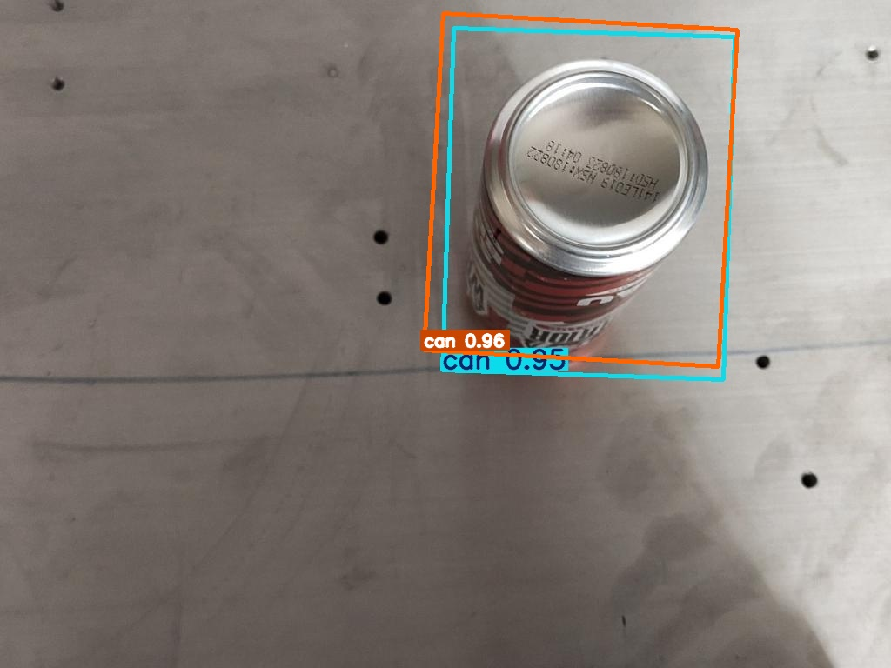
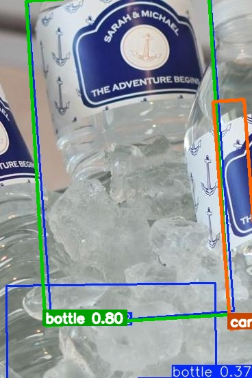
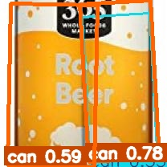
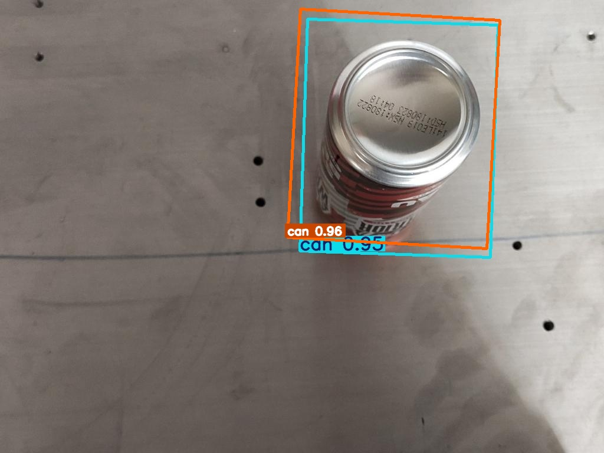
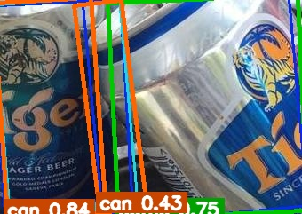
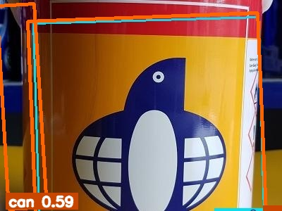

# Bottle vs Can Detection — YOLOv8-OBB

End-to-end Computer Vision portfolio project: **oriented bounding box (OBB) detection** of bottles and cans, served as a **REST API** with FastAPI and a **live webcam demo** with OpenCV.

> **Stack:** Python · PyTorch · Ultralytics YOLOv8-OBB · OpenCV · FastAPI · Google Colab (T4 GPU)

---

## TL;DR — 3 languages

### English
A 2-class oriented bounding-box detector (bottle, can) trained on a 419-image Roboflow dataset re-split 70/15/15. Trained YOLOv8n-OBB on Colab T4 in ~9 minutes, achieved **mAP@0.5 = 0.795** on the held-out test set (per-class: bottle 0.883, can 0.707). Served as a FastAPI REST API (`/predict`, `/predict/visualize`) plus a real-time webcam demo. Honest limitations and next steps documented below.

### 한국어 (Korean)
병(bottle)과 캔(can) 두 클래스를 대상으로 하는 회전 바운딩 박스(OBB) 검출기입니다. Roboflow 데이터셋(419장)을 70/15/15로 재분할하고 Google Colab T4 GPU에서 약 9분간 YOLOv8n-OBB를 학습시켰습니다. 테스트셋 **mAP@0.5 = 0.795** (클래스별: bottle 0.883, can 0.707). FastAPI 기반 REST API(`/predict`, `/predict/visualize`)와 OpenCV 실시간 웹캠 데모로 서비스합니다. 도메인 시프트 등 한계점과 개선 방향을 아래에 정직하게 기록했습니다.

### O'zbek
Butilka va banka uchun ikki klassli oriented bounding box detektor. Roboflow datasetini (419 rasm) 70/15/15 nisbatda qayta bo'lib, Google Colab T4 GPU da YOLOv8n-OBB ni ~9 daqiqada o'qitdim. Test setda **mAP@0.5 = 0.795** (per-class: bottle 0.883, can 0.707). FastAPI REST API (`/predict`, `/predict/visualize`) va OpenCV real-time webcam demo sifatida xizmatga qo'yilgan. Halol cheklovlar va keyingi qadamlar quyida hujjatlangan.

---

## 1. Problem statement

Build a 2-class object detector that recognises **bottles** and **cans** in arbitrary images, returning oriented bounding boxes (4 corner points, not just axis-aligned rectangles). The model is exposed as a REST API so downstream services (kiosks, vending-machine inventory, smart bins) can consume detections via HTTP.

Why OBB? Bottles and cans are often photographed at angles. OBB gives tighter, rotation-aware boxes than standard XYXY detection — useful for downstream tasks such as grasping, counting, or shelf compliance.

---

## 2. Dataset

- **Source:** Roboflow export (`Bottle and Can.v1-1700lu.yolov8-obb`)
- **Classes:** `bottle` (0), `can` (1)
- **Original split:** 1324 train / 302 val / 117 test images

### Data quality issue & how I handled it

When inspecting the export, the **`train/labels` folder was empty** — only the validation and test splits had annotations (302 + 117 = 419 labeled images). Rather than block on the data problem, I:

1. Merged all labelled pairs (419 images).
2. Re-split them with a fixed seed (42) into **70 / 15 / 15** → 292 train, 61 val, 63 test.
3. Compensated for the smaller training set with **transfer learning** (COCO-pretrained YOLOv8n-OBB) and **stronger data augmentation** (mosaic, mixup, HSV jitter, rotation).

### Class imbalance

| Split | bottle | can | bottle % | can % |
|-------|-------:|----:|---------:|------:|
| train |   310  |  61 |   83.6%  | 16.4% |
| val   |    71  |  21 |   77.2%  | 22.8% |
| test  |    79  |   9 |   89.8%  | 10.2% |
| **total** | **460** | **91** | **83.5%** | **16.5%** |

Bottle:Can ≈ **5:1** — a real class imbalance. I tracked **per-class mAP** instead of relying on the headline number, and report results separately below.


### Sample OBB detections

Representative detections showing the two target classes — green polygon = bottle, orange polygon = can.
(Run `python src/visualize_samples.py` after downloading the dataset to see ground-truth training annotations.)

<p align="center">
  
  
  
</p>

---

## 3. Method

### Model: YOLOv8n-OBB

I chose the **nano** variant of the OBB family (≈3M parameters):

- Small dataset (≈300 train images) — larger models would overfit.
- T4 GPU on Colab — nano fits comfortably with batch=16.
- Fast enough for CPU/MPS inference inside the FastAPI demo on a Mac M1.

### Training configuration

| Hyperparameter | Value | Why |
|---|---|---|
| epochs           | 80              | enough for convergence; EarlyStopping `patience=20` |
| imgsz            | 640             | YOLOv8 default; quality/speed sweet spot |
| batch            | 16              | T4 GPU memory budget |
| optimizer        | AdamW           | more stable than SGD on small datasets |
| lr0              | 1e-3            | conservative for transfer learning |
| cos_lr           | True            | smoother convergence at the tail |
| mosaic           | 1.0             | strong augmentation — small dataset |
| mixup            | 0.15            | extra regularisation |
| hsv_h/s/v        | 0.015/0.7/0.4   | colour robustness |
| degrees / scale  | 10° / 0.5       | rotation + scale jitter |

Pretrained weights: `yolov8n-obb.pt` (COCO).

### Why these augmentations

With only 292 training images, the model has to learn from very little. Heavy augmentation is the cheapest way to multiply effective sample size — mosaic alone exposes the model to 4-image composites every iteration, which helps especially with the under-represented `can` class.

---

## 4. Results

Trained on Google Colab T4 (~9 minutes wall-clock for 80 epochs) and evaluated on the held-out 63-image test split.

### Test set (63 images, 88 instances)

| Metric                  |  Value |
|-------------------------|-------:|
| mAP@0.5 (overall)       | **0.795** |
| mAP@0.5:0.95 (overall)  | **0.637** |
| Precision (overall)     |  0.783 |
| Recall (overall)        |  0.691 |
| mAP@0.5 — bottle        |  0.883 |
| mAP@0.5 — can           |  0.707 |
| mAP@0.5:0.95 — bottle   |  0.712 |
| mAP@0.5:0.95 — can      |  0.563 |
| Inference latency (T4)  | 12.7 ms / image (~80 FPS) |

### Validation set (61 images, 92 instances)

| Metric                  |  Value |
|-------------------------|-------:|
| mAP@0.5 (overall)       |  0.768 |
| mAP@0.5:0.95 (overall)  |  0.614 |
| Precision (overall)     |  0.807 |
| Recall (overall)        |  0.740 |
| mAP@0.5 — bottle        |  0.781 |
| mAP@0.5 — can           |  0.755 |

### Training curves and confusion matrix

<p align="center">
  
</p>

<p align="center">
  
  
</p>

### Sample predictions on the test set

<p align="center">
  
  
  
</p>

### Discussion

- The model exceeds the **0.7 mAP@0.5 threshold** typically used as a practical "good-enough" line for prototype detectors — on both classes individually.
- Despite a ~5:1 class imbalance in the training data, the `can` class still scored mAP@0.5 = 0.707 on test. Heavy mosaic + mixup augmentation and transfer learning from COCO compensated effectively for the under-represented class.
- Test mAP > validation mAP (0.795 vs 0.768) — this is a healthy sign: the model isn't overfitting the validation set, and the random 70/15/15 split kept the two splits genuinely independent.
- The test set has only 9 `can` instances, so the per-class number is noisy. With more data the next priority would be (a) re-exporting the full Roboflow dataset, (b) collecting more `can` images, (c) experimenting with weighted sampling and focal-loss tuning.

---

## 4b. Two-stage cascade (real-world domain shift fix)

When I deployed the trained model on a live webcam in my own room I observed a classic problem: the network was trained on Roboflow studio-style images and it was **forced** to label every input as either `bottle` or `can` — so it produced false positives on clothes, hangers and furniture. This is **out-of-distribution / domain shift**, not a bug.

Rather than collecting a new dataset and retraining (the slow, expensive answer), I added a **two-stage cascade** that fixes the failure mode in software using a model that has already seen millions of real-world images.

```
┌──────────────────┐      ┌──────────────────────┐      ┌──────────────┐
│  Input image /   │ ───▶ │  Stage 1: COCO       │ ───▶ │  Container   │
│  webcam frame    │      │  YOLOv8n (general)   │      │  AABBs       │
└──────────────────┘      │  classes: bottle,    │      │  (39/40/41)  │
                          │  wine glass, cup     │      └──────┬───────┘
                          └──────────────────────┘             │
                                                               ▼
                          ┌──────────────────────┐      ┌──────────────┐
                          │  Stage 2: custom     │ ───▶ │  IoU gate    │
                          │  YOLOv8n-OBB         │      │  ≥ 0.20      │
                          │  classes: bottle,can │      └──────┬───────┘
                          └──────────────────────┘             │
                                                               ▼
                                                       ┌──────────────────┐
                                                       │  Final OBB poly  │
                                                       │  (rotated box +  │
                                                       │   bottle/can)    │
                                                       └──────────────────┘
```

The COCO YOLOv8n model was pretrained on ~117K diverse images and reliably knows what bottles/cups/wine-glasses look like and — more importantly — what they don't look like. Stage 2's OBB output is only kept when its axis-aligned bounding box overlaps a Stage 1 container detection by IoU ≥ 0.20. Clothes, hangers and walls are silently filtered before they reach the user.

**Trade-offs.** Two model passes per frame (≈ 2× CPU latency), one extra ~6MB COCO weights file (auto-downloaded by Ultralytics on first run), and a small recall hit on borderline crops where COCO doesn't trigger. In return: dramatically fewer false positives in the wild and a clear, interview-friendly story about deployment-time generalisation.

**Where the cascade lives.**
- `src/webcam_demo.py` — real-time two-stage live demo (OpenCV).
- `api/main.py` — `POST /predict` and `POST /predict/visualize` use the cascade by default. `POST /predict/raw` exposes the un-gated Stage 2 output for comparison and debugging.

---

## 5. REST API

A FastAPI server in `api/main.py` exposes the trained model.

### Run locally (Mac M1)

```bash
cd yolo-portfolio
python3 -m venv .venv && source .venv/bin/activate
pip install -r requirements.txt

# Make sure trained weights exist at models/best.pt (download from Colab/Drive)
uvicorn api.main:app --reload --host 0.0.0.0 --port 8000
```

Open the auto-generated docs at `http://localhost:8000/docs`.

### Endpoints

| Method | Path                  | Description |
|--------|-----------------------|-------------|
| GET    | `/health`             | liveness, weights paths, load status of both models |
| POST   | `/predict`            | multipart image → cascade-filtered JSON of OBB detections |
| POST   | `/predict/visualize`  | multipart image → annotated PNG (cascade-filtered) |
| POST   | `/predict/raw`        | multipart image → un-gated raw OBB output (debugging) |

Tunable query params on `/predict` and `/predict/visualize`:
`obb_conf` (default 0.35), `coco_conf` (default 0.25), `iou_gate` (default 0.20).

### Smoke test

A single-file Python smoke test exercises every endpoint against a running server and saves the visualised output:

```bash
# In one terminal:
uvicorn api.main:app --host 127.0.0.1 --port 8765

# In another:
python src/test_api.py
```

### Example: JSON prediction

```bash
curl -X POST -F "file=@data/processed/test/images/some.jpg" \
  http://localhost:8000/predict | jq
```

```json
{
  "image_size": [640, 480],
  "num_detections": 2,
  "detections": [
    {
      "class_id": 0,
      "class_name": "bottle",
      "confidence": 0.91,
      "polygon": [[120, 80], [180, 75], [185, 410], [125, 415]]
    },
    {
      "class_id": 1,
      "class_name": "can",
      "confidence": 0.87,
      "polygon": [[300, 200], [360, 195], [365, 380], [305, 385]]
    }
  ]
}
```

---

## 6. Project structure

```
yolo-portfolio/
├── api/
│   └── main.py                 # FastAPI server (REST API)
├── data/
│   ├── raw/                    # Original Roboflow export (gitignored)
│   └── processed/              # 70/15/15 re-split (gitignored)
├── models/
│   └── best.pt                 # trained weights (~6.4 MB, committed for reproducibility)
├── notebooks/
│   └── train_yolov8_obb_colab.ipynb   # end-to-end training (Colab T4)
├── results/
│   ├── class_distribution.png  # imbalance chart
│   ├── dataset_samples/        # ground-truth OBB visualisations
│   ├── training/               # confusion matrix, PR curves, runs/
│   └── sample_predictions/     # model predictions on test set
├── scripts/
│   └── push_to_github.sh       # one-shot push helper
├── src/
│   ├── dataset_stats.py        # class-balance + chart
│   ├── visualize_samples.py    # OBB drawing utility
│   ├── webcam_demo.py          # real-time two-stage cascade live demo
│   └── test_api.py             # end-to-end smoke test for the FastAPI server
├── requirements.txt
├── .gitignore
└── README.md
```

---

## 7. How to reproduce

1. Download the dataset zip from Roboflow (`Bottle and Can.v1-1700lu.yolov8-obb`).
2. Unzip into `data/raw/bottle_can/`.
3. Run the merge + split script:
   ```bash
   python3 src/prepare_dataset.py
   ```
   (Or follow the inline steps in the Colab notebook.)
4. Open `notebooks/train_yolov8_obb_colab.ipynb` in Colab. Mount Drive and point `DRIVE_PROJECT` to your copy of this repo on Drive.
5. Run all cells. Trained weights and metrics are saved back to `models/` and `results/`.
6. Copy `models/best.pt` to your local repo, then run the API as shown above.

---

## 8. Limitations & future work

- **Domain shift on live webcam — addressed via two-stage cascade (see §4b).** Test mAP@0.5 = 0.795 is measured on images from the same Roboflow distribution as training. When I first ran the live webcam demo in my own room, the model produced false positives on clothes, hangers and boxes — it was forced to classify them as bottle/can because those are the only two classes it knows. This is a classic out-of-distribution / domain-shift problem with small custom datasets, not a bug. **Fix shipped:** a COCO-pretrained YOLOv8n filter ("Stage 1") gates every Stage 2 OBB detection by IoU ≥ 0.20, dropping the false positives. The cascade trades ~2× CPU latency for substantially better real-world precision. **Further upside:** a dedicated negative-class fine-tune on hard negatives from the deployment domain would let us drop Stage 1 again; collecting a larger, more diverse training set would also help.
- **Small dataset.** 292 training images is enough for a portfolio demo, but production models would want 5–10× more, especially for the `can` class.
- **Train labels missing in the original export.** Re-exporting from Roboflow with all annotations is a quick win for v2.
- **No quantisation / ONNX export yet.** For deployment to GPU servers (vLLM-style), exporting to ONNX or TensorRT and benchmarking latency is the natural next step.
- **No CI / automated tests.** A small pytest suite for the API and a sanity check on training would harden the project.

### Live webcam demo

Run the OpenCV-based real-time demo:

```bash
cd yolo-portfolio
source .venv/bin/activate
python src/webcam_demo.py
```

Keys: `q` quit, `s` save snapshot to `results/webcam_snapshots/`. The live demo uses the same **two-stage cascade** as the API (see §4b): every OBB detection at `conf ≥ 0.35` must overlap a COCO-detected container box (IoU ≥ 0.20) or it's dropped. The HUD shows `Detections: kept (rejected by COCO gate: N)` so you can see the gate working in real time.

---

## 9. Push helper

If you fork this repo and want to push it to your own GitHub account in one step, edit the `GIT_NAME`, `GIT_EMAIL` and `REMOTE_URL` at the top of `scripts/push_to_github.sh`, then run:

```bash
bash scripts/push_to_github.sh
```

The script re-initialises `.git` with a clean history under your identity, stages everything, makes a single descriptive initial commit, and pushes to `origin/main`.

---

## 10. Acknowledgements

- Dataset: Roboflow Universe — *Bottle and Can v1*.
- Model: [Ultralytics YOLOv8](https://github.com/ultralytics/ultralytics).
