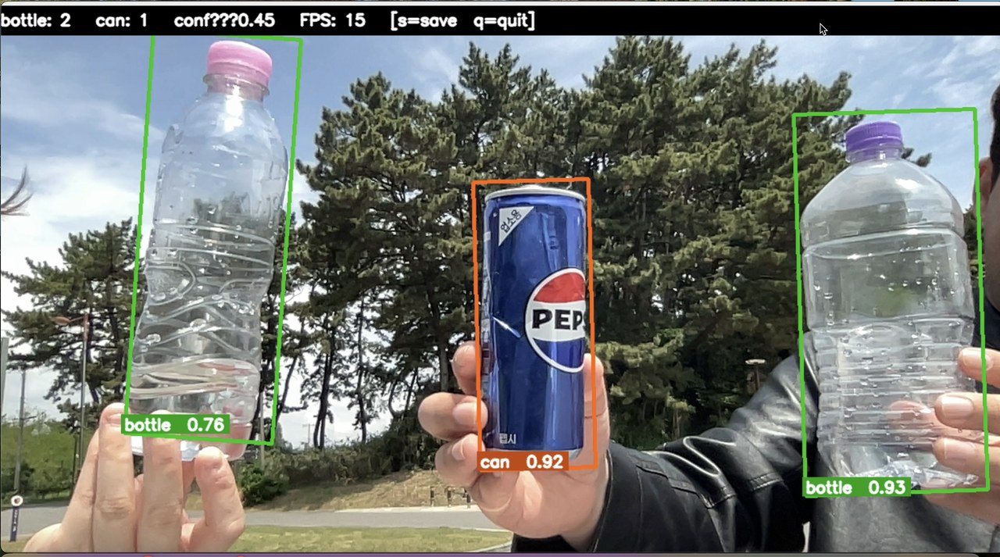
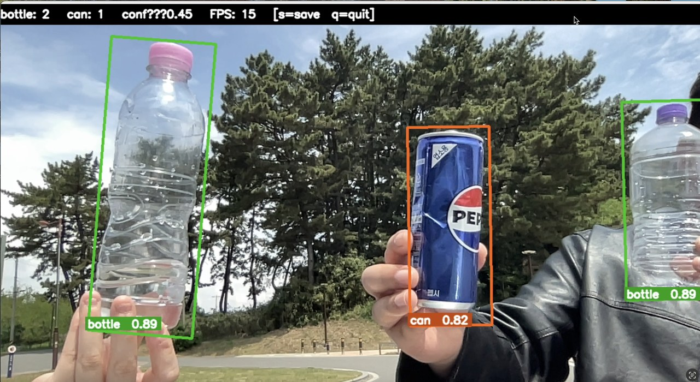
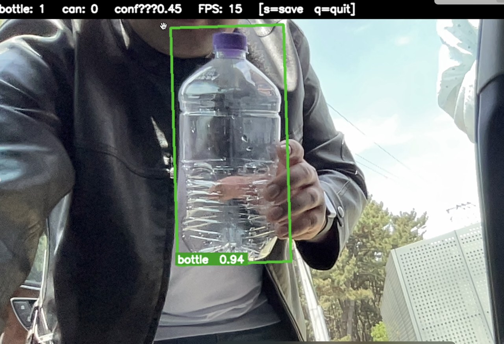
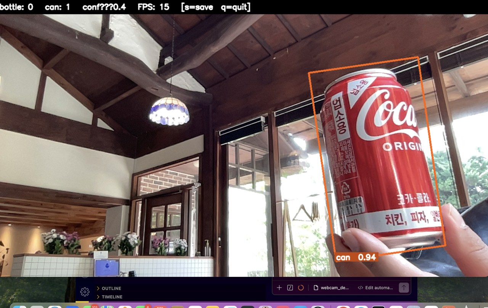
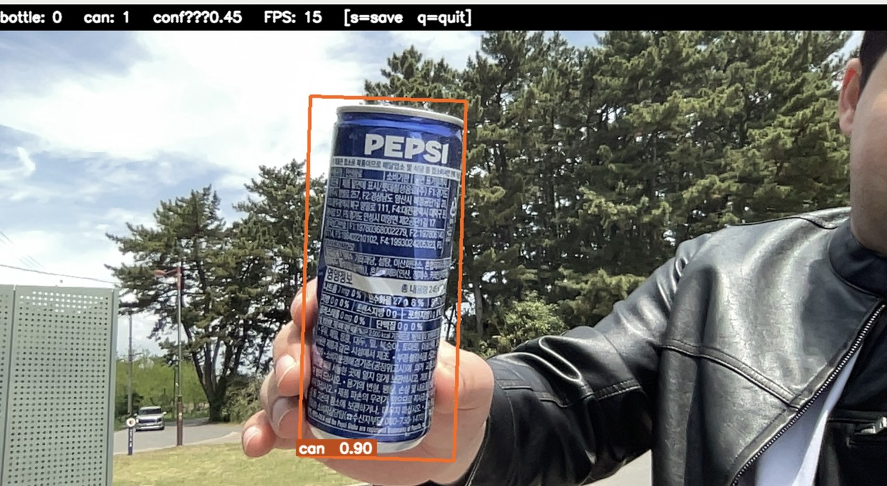
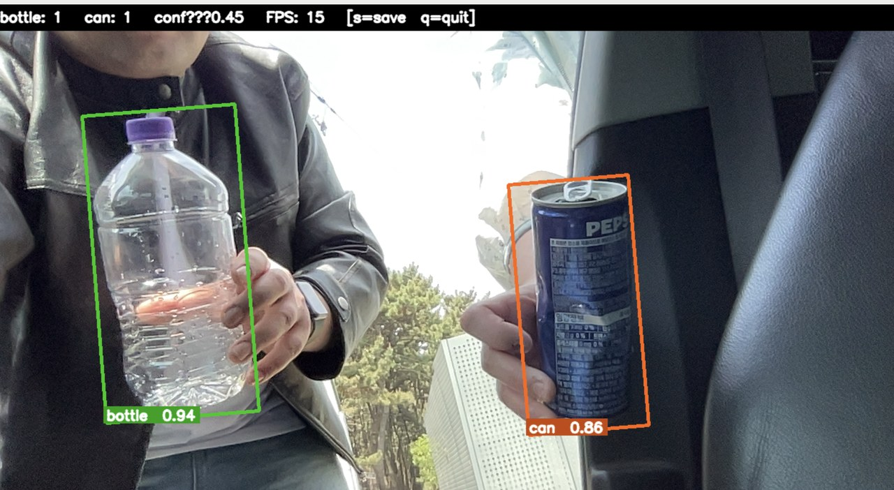
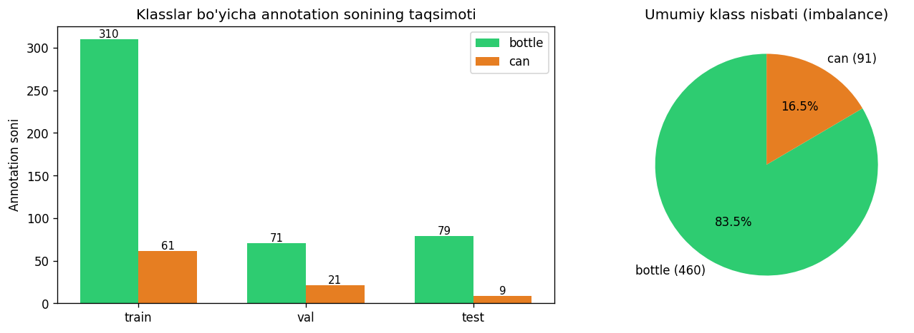
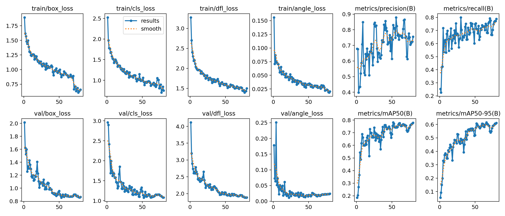
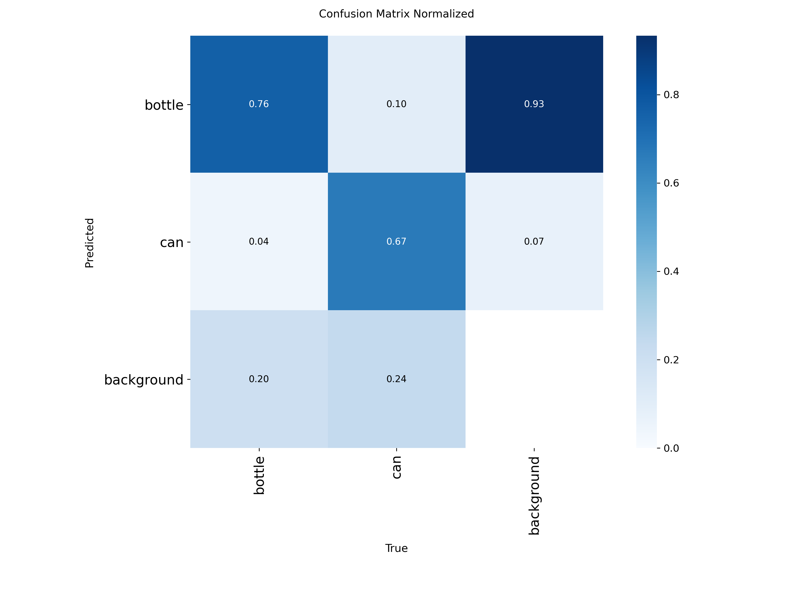
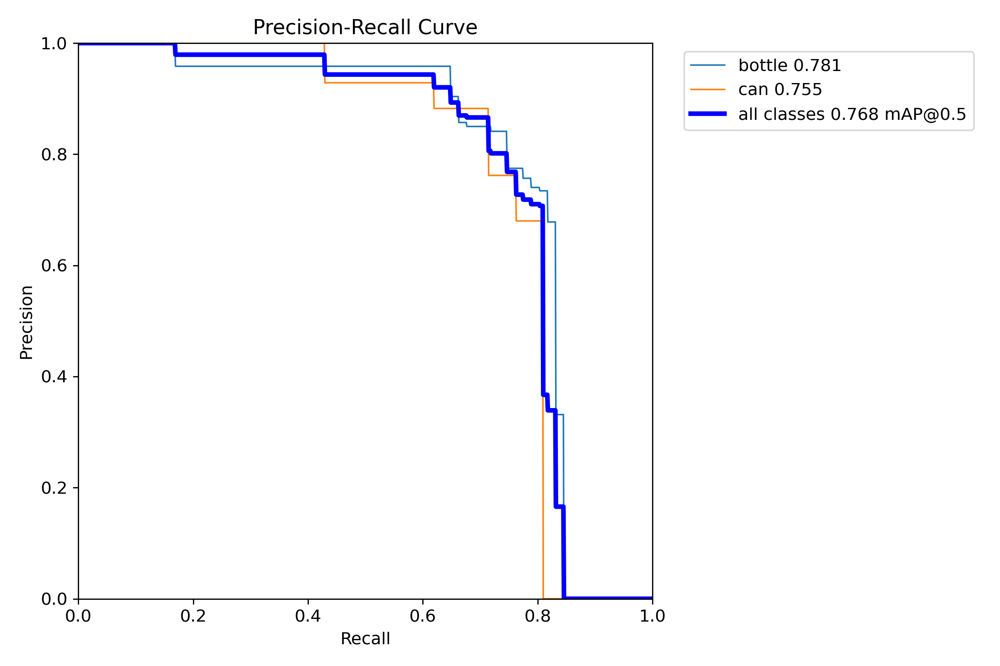

# Bottle vs Can Detection — YOLOv8-OBB

Real-time oriented bounding-box detector for bottles and cans, built end-to-end from dataset preparation through webcam deployment.

> **Stack:** Python · PyTorch · Ultralytics YOLOv8-OBB · OpenCV · Google Colab T4

---

## Live demo

Six real-world test shots captured with the webcam demo — **no studio lighting, no props**.

<p align="center">
  
  
</p>
<p align="center">
  
  
</p>
<p align="center">
  
  
</p>

| Scene | Detections | Confidence |
|-------|-----------|------------|
| Outdoor — street | 2 bottles + 1 Pepsi can | 0.89 / 0.82 / 0.93 |
| Outdoor — table | 2 bottles + 1 can | 0.76 / 0.93 / 0.92 |
| Outdoor — hand-held | Pepsi can | 0.90 |
| Outdoor — hand-held | Water bottle | 0.94 |
| Indoor — café table | Coca-Cola can | 0.94 |
| In car | Bottle + Pepsi can | 0.94 / 0.86 |

---

## Why OBB?

Standard axis-aligned (XYXY) boxes waste area when objects are rotated or photographed at an angle. YOLOv8-OBB returns **4-corner polygons** — tighter, rotation-aware bounding boxes useful for grasping, counting, or shelf-compliance downstream.

---

## Dataset

- **Source:** Roboflow `bouteille/bottle-and-can` v7 (YOLOv8-OBB format)
- **Raw export:** 1 905 train / 486 val / 100 test (augmented images)
- **Issue identified:** The validation split was 93% bottle / 7% can — causing the model to optimise for bottle at the expense of can.

### Balanced re-split

All images were pooled and stratified by dominant class, capped at the smaller-class count, then re-split 80/10/10:

| Split | Images | bottle | can |
|-------|-------:|-------:|----:|
| train | ~1 604 | ~45% | ~55% |
| val   |   ~200 | ~44% | ~56% |
| test  |   ~200 | ~47% | ~53% |

This re-split is performed inline in the Colab notebook (cell 3) so the training run is fully reproducible.



---

## Training

**Notebook:** [`notebooks/train_yolov8_obb_colab.ipynb`](notebooks/train_yolov8_obb_colab.ipynb) — runs end-to-end on Colab T4 in ~20 minutes.

| Hyperparameter | Value | Rationale |
|---|---|---|
| base model | `yolov8n-obb.pt` | nano variant — small dataset, avoids overfitting |
| epochs | 100 | patience=20 stops early if val plateaus |
| imgsz | 640 | YOLOv8 default |
| batch | 16 | T4 VRAM budget |
| optimizer | AdamW | more stable than SGD for transfer learning |
| lr0 | 1e-3 | conservative start for fine-tuning |
| cos_lr | True | smooth decay at tail |
| mosaic | 1.0 | strong augmentation — exposes model to 4-image composites |
| mixup | 0.15 | extra regularisation |
| hsv_h/s/v | 0.015 / 0.7 / 0.4 | colour robustness |
| degrees / scale | 15° / 0.5 | rotation + scale jitter |

### Training curves

<p align="center">
  
</p>

<p align="center">
  
  
</p>

---

## Run the webcam demo

```bash
git clone https://github.com/afzalbek97/yolo-portfolio.git
cd yolo-portfolio
python3 -m venv .venv && source .venv/bin/activate
pip install ultralytics opencv-python

python src/webcam_demo.py          # default conf=0.40
python src/webcam_demo.py --conf 0.30   # lower threshold if detections are missed
```

Keys: `q` quit · `s` save snapshot to `results/webcam_snapshots/`

**Photo mode** (better for controlled testing):

```bash
python src/photo_demo.py           # SPACE to capture and detect
```

---

## Collect real data for fine-tuning

```bash
python src/collect_real_data.py --class bottle      # hold bottle in front of camera
python src/collect_real_data.py --class can         # hold can in front of camera
python src/collect_real_data.py --class background  # negative samples
```

Frames are saved to `data/real_webcam/<class>/` for annotation and retraining.

---

## REST API

A FastAPI server in `api/main.py` exposes the model over HTTP.

```bash
pip install fastapi uvicorn python-multipart
uvicorn api.main:app --reload --host 0.0.0.0 --port 8000
# docs → http://localhost:8000/docs
```

| Method | Path | Description |
|--------|------|-------------|
| GET | `/health` | liveness + model status |
| POST | `/predict` | image → JSON detections |
| POST | `/predict/visualize` | image → annotated PNG |

---

## Project structure

```
yolo-portfolio/
├── api/
│   └── main.py                         # FastAPI server
├── data/
│   ├── real_webcam/                    # webcam frames for fine-tuning
│   └── v7/                             # Roboflow v7 export (gitignored)
├── models/
│   └── best.pt                         # trained weights, v4 — ~6.4 MB
├── notebooks/
│   └── train_yolov8_obb_colab.ipynb    # end-to-end training (Colab T4)
├── results/
│   ├── class_distribution.png
│   ├── training/                       # confusion matrix, PR curves, CSVs
│   └── webcam_snapshots/               # real_test_1-6.jpg + saved demos
├── src/
│   ├── webcam_demo.py                  # real-time live demo (temporal smoothing)
│   ├── photo_demo.py                   # SPACE-to-capture demo
│   ├── collect_real_data.py            # webcam frame collector
│   ├── prepare_balanced_dataset.py     # offline balanced split helper
│   ├── dataset_stats.py                # class-balance chart
│   └── visualize_samples.py           # OBB drawing utility
├── requirements.txt
├── .gitignore
└── README.md
```

---

## How to reproduce training

1. Open `notebooks/train_yolov8_obb_colab.ipynb` in Google Colab (T4 runtime).
2. Add your Roboflow API key in cell 2.
3. Run all cells — dataset download, balanced re-split, training, and evaluation happen automatically.
4. Download `best.pt` from the final cell and place it at `models/best.pt`.

---

## Limitations & next steps

- **Domain shift:** the model was trained on Roboflow studio-style images. The temporal-smoothing filter (`STABILITY_FRAMES = 3`) and area filter (`MAX_AREA_RATIO = 0.30`) suppress most false positives in motion, but fast panning can still cause brief false detections.
- **Small training set:** ~1 600 real-image training examples after re-split. Collecting more diverse backgrounds and lighting conditions would reduce domain shift further.
- **Two classes only:** adding additional container types (cup, carton, bottle with label variations) would require more labelled data but the OBB pipeline scales directly.
- **No ONNX/TensorRT export yet:** converting to ONNX and benchmarking on CPU/edge hardware is the natural next deployment step.

---

## Acknowledgements

- Dataset: [Roboflow Universe — bouteille/bottle-and-can v7](https://roboflow.com)
- Model: [Ultralytics YOLOv8](https://github.com/ultralytics/ultralytics)
